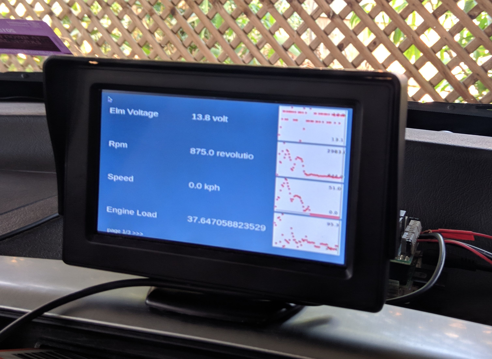

# OnBoard-Diagnose Dashboard(OBD) with Raspberry Pi4.




## Hardware
- Raspberry Pi with Bluetooth & Wi-Fi (inbuilt or USB dongle, doesn't matter)
- OBD2 Bluetooth module (Veepeak-OBDCheck VP11)
- [PiFace Digital](http://www.piface.org.uk/products/piface_digital/) to switch video input & detect button presses. I had this lying around, otherwise you can use any kind of relay board and wire your own buttons to GPIO. 
- Reversing camera / dash cam with video output
- Display with composite video input


### Wiring
Relays: NC (normally closed, i.e. connected by default when Pi is off), CO (common), NO (normally open)
```
RPi <<<GPIO>>> PiFace
PiFace relay 0/1 <<<NC>>> RPi video out
                 <<<CO>>> Display video in
                 <<<NO>>> Camera video out
                 <<<GND>>> Ground of all cables
```
### Power
I only had one 12V socket available at the front of the car, and the dashcam was already using this, so I took apart the plug, made a small hole and soldered two extra wires to power the 12V display. 

The Pi gets power from a USB socket on the CD player meant for flash disks (it apparently provides adequate current, use a USB voltage/current meter to check you're still getting 5+/-0.25V if you're trying such tricks). 


## Software setup
- Connect module to car
- On the Pi, in a terminal, run:
    - `sudo apt update && sudo apt upgrade`
    - `sudo apt install python3 python3-pip`
    - `sudo apt install python3-tk`
    - `sudo pip3 install python-can`
    - `sudo pip3 install obd PySimpleGUI keyboard`
    - `git clone https://github.com/VirgileDjimgou/Car-OBD-GUI-Interface.git`
- To connect to the module, run:
    - `bluetoothctl` to enter bluetoothctl shell
    - `scan on` and `scan off` once you see your module
    - `pair [MAC]` where MAC is the address of your OBD module
    - `trust [MAC]`
    - `paired-devices` check your module is listed
    - `quit` to exit bluetoothctl shell
    - `sudo sdptool add SP`
    - `sudo rfcomm connect hci0 [MAC]` you should see 'press ctrl+c for hangup'
- Now to see if you can interface with the module:
    - `cd` into `obd-gui`
    - `python3 gui.py`, if you see the numbers and graph updating, great! Otherwise Check the [troubleshooting guide](https://python-obd.readthedocs.io/en/latest/Troubleshooting/) and [issues in the repo](https://github.com/brendan-w/python-OBD/issues). You may have to dig into the pythonOBD source in `~/.local/lib/python3.7/site-packages/obd`
- PiFace config steps:
    - unfortunately the apt and pip packages for the piface don't seem to exist anymore, so we have to install manually. `git clone` both [pifacecommon](https://github.com/piface/pifacecommon) and [pifacedigital-io](https://github.com/piface/pifacedigitalio), `cd` into the directories and run `sudo python3 setup.py install` for both modules
    - enable SPI in `sudo raspi-config`, under 'interfacing' (iirc)
    - run `sudo python3 piface.py` from the `obd-gui` folder. sudo is required for the `keyboard` module to work and emulate keypresses
    - try pressing the first button, the relay should switch. The second and third buttons should emulate the left and right arrow keys respectively
- Autostart the apps with the Pi:
    - copy the files in `autostart` to `/etc/xdg/autostart`. Make any necessary edits to the desktop files.
    - add your module's MAC address in `connect.sh`
    - if the scripts complain about missing modules when running with sudo, uncomment the `sys.path.append` lines at the top of `gui.py` and `piface.py` (edit as necessary depending on your Python version, you can run `pip3 show obd` to see where your package is installed). This is a quick fix solution, there are cleaner ways if you edit sudoers, etc.

    # test with ECU Emulator 
    - `cd ecu-simulator`
    - `puthon3 ecu-simulator.py`


## Modifying the GUI
The GUI uses the PySimpleGUI Tkinter library . You can adjust the font, refresh rate etc easily by modifying the constants and/or the `layout` array.